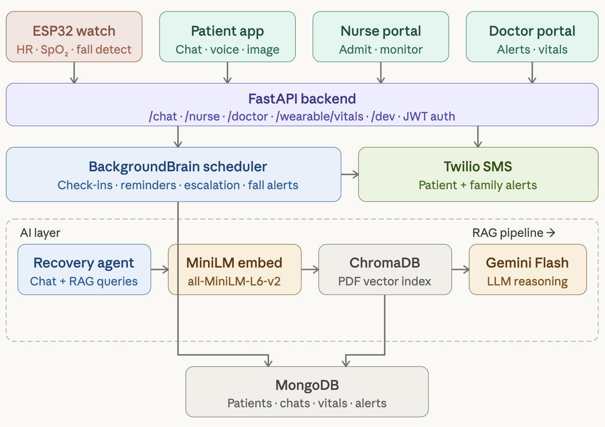
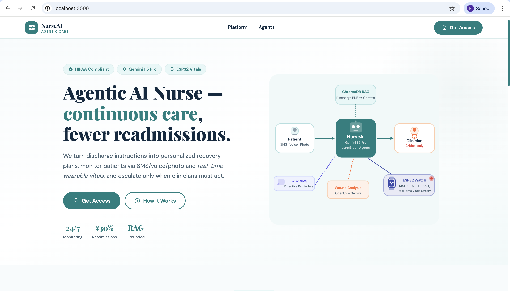
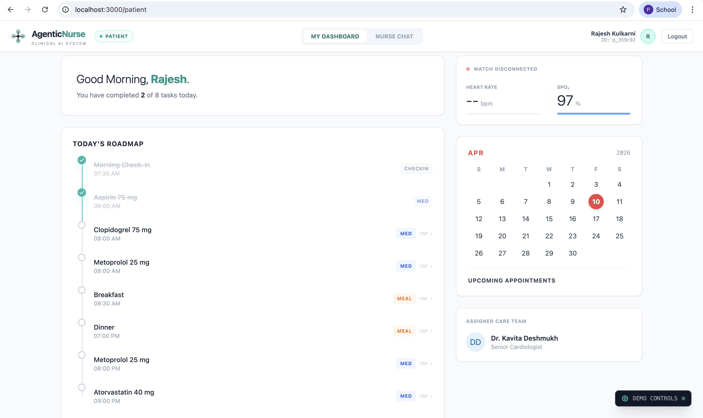
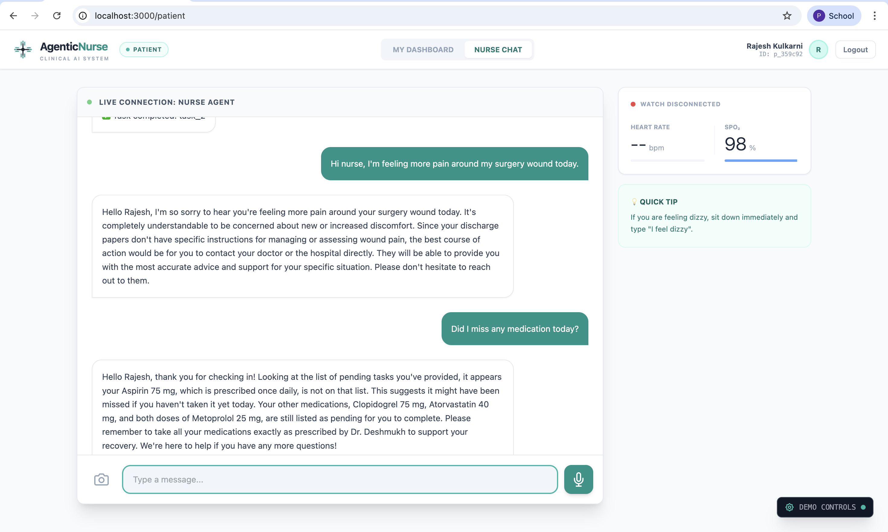
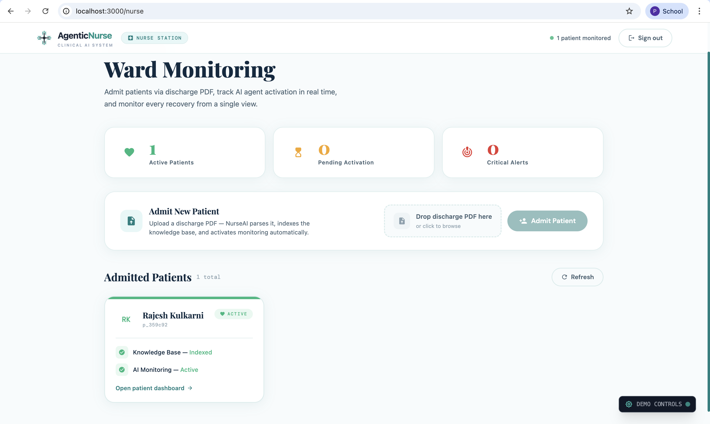
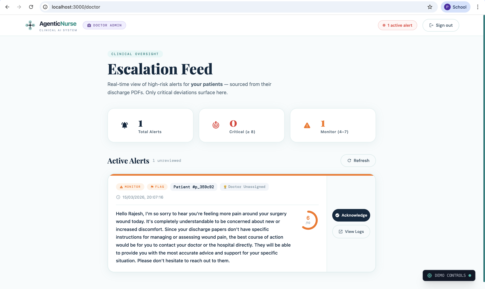
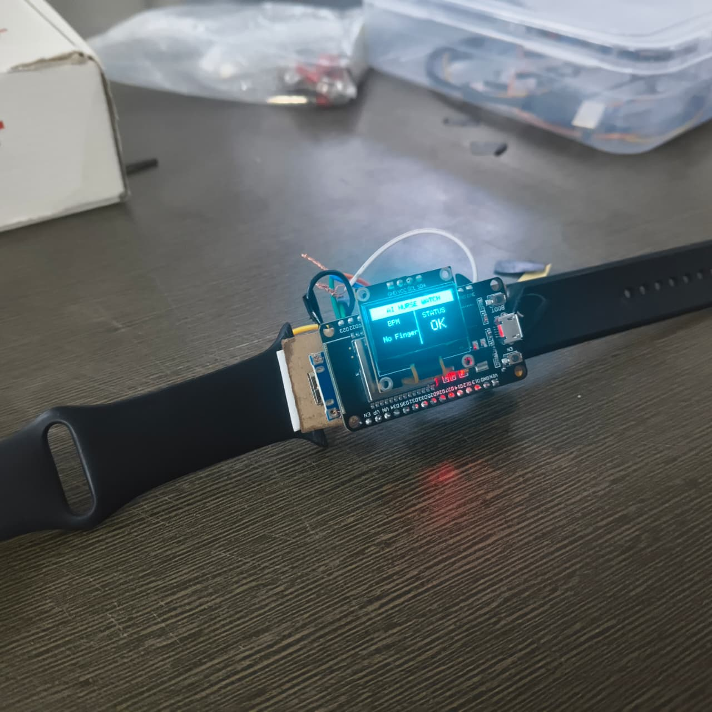

# Agentic AI Nurse
🏆 2nd Place Winner — Sinhgad Hackathon 2026

An **autonomous AI-powered healthcare monitoring system** designed to assist patients after hospital discharge by continuously monitoring recovery, ensuring medication adherence, and detecting early warning signs of complications.

Agentic AI Nurse acts as a **digital healthcare companion**, bridging the gap between hospital discharge and full recovery through intelligent agents, multimodal health analysis, and wearable health monitoring.

---

## Problem

After leaving the hospital, many patients struggle with:

* Missed medications
* Forgotten follow-up appointments
* Poor understanding of discharge instructions
* Delayed detection of complications

Healthcare providers also face difficulty **monitoring patients remotely at scale**.

These issues often lead to **avoidable hospital readmissions, higher costs, and increased patient risk**.

---

## Solution

Agentic AI Nurse is an **agent-driven AI system** that continuously monitors patient recovery using:

* AI-powered medical reasoning
* wearable health sensors
* voice and image analysis
* automated patient communication

The system proactively detects risks, reminds patients about medications, and escalates critical cases to doctors.

---

## Key Features

### Agentic AI Care Management

Autonomous AI agents manage patient recovery plans, analyze incoming health data, and take actions such as reminders, alerts, and triage escalation.

### Multimodal Health Monitoring

The system combines multiple health signals:

* Heart rate monitoring from wearable devices
* Wound image analysis for infection detection

### Smart Medication Compliance

Patients receive automated reminders through SMS or messaging platforms.
Missed doses trigger follow-ups and escalation to caregivers if necessary.

### Personalized Medical Guidance (RAG)

Patient discharge summaries are indexed into a **vector database**, enabling the AI nurse to generate medically grounded responses tailored to each patient.

### Clinical Triage Dashboard

Healthcare providers can monitor multiple patients simultaneously through a real-time dashboard that prioritizes high-risk cases.

### Wearable Health Monitoring

A custom **ESP32-based smartwatch** collects physiological data including:

* Heart rate
* motion/activity
* vital monitoring

These readings are streamed to the backend for continuous monitoring.

---

## 🏗 System Architecture


## ⚙️ Tech Stack

### Backend

* Python
* FastAPI
* LangChain / LangGraph
* ChromaDB (Vector Database)
* MongoDB
* Firebase

### AI / Multimodal Processing

* Gemini / LLM APIs
* OpenCV (image preprocessing)
* Librosa (audio analysis)

### Communication

* Twilio API (SMS alerts & notifications)

### Frontend

* React.js
* TailwindCSS

### Hardware

* ESP32 Microcontroller
* MAX30102 Heart Rate Sensor
* MPU650 Motion Sensor
* OLED Display

---

## Working Prototype

### LandingPage
<p align="center">
  
</p>

### Patient HomePage
<p align="center">
  
</p>

### chatbot
<p align="center">
  
</p>

### Nurse Monitoring Dashboard
<p align="center">
  
</p>

### Doctor Alert Dashboard
<p align="center">
  
</p>

### ESP32 Smart Watch Prototype
<p align="center">
  
</p>


## 📂 Project Structure

```
agentic-nurse-project

backend/
   app/
      agents/
      knowledge/
      tools/
      utils/
      main.py
      models.py

frontend/
   src/
      components/
      services/
   App.js

Hardware/
   watch.py

requirements.txt
README.md
```

---

## Installation

### 1️ Clone Repository

```
git clone https://github.com/Pranav-Rajput5/agentic-ai-nurse.git
cd agentic-ai-nurse
```

---

### 2️ Backend Setup

```
cd backend
python -m venv env
source env/bin/activate
pip install -r requirements.txt
```

Run server:

```
uvicorn app.main:app --reload
```

---

### 3️ Frontend Setup

```
cd frontend
npm install
npm start
```

---

### 4️ Hardware Integration

The ESP32 wearable streams physiological data to the backend through API endpoints.

Sensors used:

* MAX30102 → Heart rate monitoring
* MPU650 → Motion detection
* OLED display → Real-time vitals display

---

## 🔒 Safety & Reliability

The system follows a **human-in-the-loop model**:

* AI provides decision support
* doctors review critical alerts
* all responses are grounded using patient discharge documents

This approach minimizes AI hallucinations and ensures medically safe recommendations.

---

## Future Improvements

* integration with hospital EHR systems
* advanced wearable biosensors
* predictive health risk modeling
* multilingual patient interaction
* mobile application support

---

## Team

- **[Pranav Rajput](https://github.com/Pranav-Rajput5)**
- **[Parth Sardeshmukh](https://github.com/ParthTimeDEV)**
- **[Sumit Rathod](https://github.com/sumit-0306)**
- **[Rushant Meshram](https://github.com/rushant22)**
